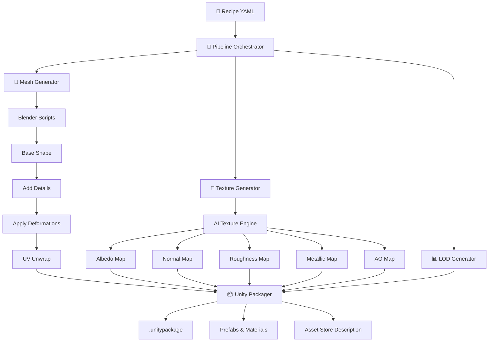
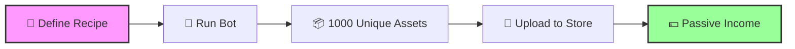

<div align="center">

# 🎮 3D Game Asset Pack Bot


### *Automate Your Game Asset Empire*

[](https://python.org)
[](https://blender.org)
[](https://stability.ai)
[](https://unity.com)

[](https://opensource.org/licenses/MIT)
[](http://makeapullrequest.com)
[](https://github.com/yourusername/3dgamesassetpackbot/graphs/commit-activity)

<p align="center">
  <strong>Generate thousands of unique 3D game assets automatically</strong><br>
  Procedural Meshes • AI Textures • Auto LODs • Unity Packaging
</p>

[Getting Started](#-quick-start) •
[Features](#-features) •
[Documentation](#-recipe-system) •
[Business Model](#-the-business-model) •
[Contributing](#-contributing)

---

</div>

## 📋 Table of Contents

- [Overview](#-overview)
- [Features](#-features)
- [Quick Start](#-quick-start)
- [Installation](#-installation)
- [Usage](#-usage)
- [Recipe System](#-recipe-system)
- [Architecture](#-architecture)
- [Configuration](#%EF%B8%8F-configuration)
- [Output Structure](#-output-structure)
- [Python API](#-python-api)
- [The Business Model](#-the-business-model)
- [Performance](#-performance)
- [Tech Stack](#-tech-stack)
- [Roadmap](#-roadmap)
- [Contributing](#-contributing)
- [Support](#-support)

---

## 🌟 Overview

**3D Game Asset Pack Bot** is a fully automated pipeline that transforms simple "recipes" into massive libraries of unique, sellable game assets. Define what you want once, and let the bot generate thousands of variations while you sleep.

### The Problem It Solves

Creating game assets is:
- ⏰ **Time-consuming** - Modeling, texturing, and optimizing takes hours per asset
- 🔄 **Repetitive** - Making variations manually is tedious
- 💰 **Expensive** - Hiring artists or buying assets adds up quickly
- 📦 **Complex** - Packaging for game engines requires specific formats

### The Solution

This bot **automates everything**:
1. **Define** your asset in a simple YAML recipe
2. **Generate** thousands of unique variations procedurally
3. **Texture** each with AI-generated PBR materials
4. **Optimize** with automatic LOD generation
5. **Package** into Unity-ready `.unitypackage` files
6. **Profit** by selling on asset marketplaces

---

## ✨ Features

<table>
<tr>
<td width="50%">

### 🔧 Procedural Generation
- **Multiple Base Shapes**: Cube, Sphere, Cylinder, Cone
- **Randomized Variations**: Size, noise, damage, details
- **Surface Details**: Panels, bolts, vents, cracks, dents
- **Style Control**: Stylized, realistic, low-poly

</td>
<td width="50%">

### 🎨 AI Texture Pipeline
- **Stable Diffusion** integration
- **Complete PBR Maps**: Albedo, Normal, Roughness, Metallic, AO, Emission
- **Seamless Tiling** for perfect repetition
- **Material Types**: Metal, wood, stone, plastic

</td>
</tr>
<tr>
<td width="50%">

### 📊 Automatic Optimization
- **LOD Generation**: Multiple detail levels
- **Smart UV Unwrapping**: Optimal texture mapping
- **Performance Tuning**: Game-ready assets
- **Batch Processing**: Generate hundreds in parallel

</td>
<td width="50%">

### 📦 Game Engine Ready
- **Unity Packaging**: `.unitypackage` export
- **Prefabs & Materials**: Pre-configured
- **Multiple Formats**: FBX, OBJ, Blend
- **Marketplace Ready**: Auto-generated descriptions

</td>
</tr>
</table>

---

## 🚀 Quick Start

```bash
# 1. Clone the repository
git clone https://github.com/yourusername/3dgamesassetpackbot.git
cd 3dgamesassetpackbot

# 2. Install dependencies
pip install -e .

# 3. Create a recipe from preset
asset-bot create-recipe "My Sci-Fi Crates" --preset scifi_crate

# 4. Generate 1000 unique assets!
asset-bot generate My_Sci-Fi_Crates.yaml --count 1000
```

**That's it!** Your assets are now ready in the `output/` directory.

---

## 💻 Installation

### Prerequisites

| Requirement | Version | Purpose |
|-------------|---------|---------|
|  | 3.8+ | Core runtime |
|  | 3.0+ | Mesh generation |
|  | Optional | GPU acceleration |

### Standard Installation

```bash
# Clone repository
git clone https://github.com/yourusername/3dgamesassetpackbot.git
cd 3dgamesassetpackbot

# Install core package
pip install -e .
```

### With AI Texture Generation

```bash
# Install with AI dependencies (requires ~10GB disk space)
pip install -e ".[ai]"
```

### Development Setup

```bash
# Install with dev tools
pip install -e ".[dev]"

# Run tests
pytest tests/
```

---

## 🎯 Usage

### CLI Commands

| Command | Description |
|---------|-------------|
| `asset-bot generate <recipe>` | Generate assets from recipe |
| `asset-bot create-recipe <name>` | Create new recipe from preset |
| `asset-bot validate <recipe>` | Validate recipe without generating |
| `asset-bot list-presets` | Show available presets |
| `asset-bot info` | Check system dependencies |
| `asset-bot init-config` | Create default configuration |

### Generate Assets

```bash
# Basic generation
asset-bot generate recipes/scifi_crates_1000.yaml

# With custom options
asset-bot generate recipe.yaml \
  --config config.yaml \          # Custom configuration
  --output ./custom_output \      # Override output directory
  --count 500 \                   # Generate 500 assets
  --dry-run                       # Validate only (no generation)
```

### Create Custom Recipe

```bash
# From preset
asset-bot create-recipe "Epic Rocks" --preset stylized_rock

# Available presets:
# • scifi_crate     - Sci-fi cargo containers
# • stylized_rock   - Fantasy rocks and boulders
# • metal_barrel    - Industrial drums
# • wooden_crate    - Rustic wooden boxes
```

---

## 📝 Recipe System

Recipes are YAML files that define your asset pack:

```yaml
# recipes/my_awesome_pack.yaml

name: "1000 Stylized Sci-Fi Crates Pack"
description: "Unique sci-fi cargo crates for space stations"
version: "1.0.0"
author: "Your Name"
tags: [sci-fi, crate, futuristic, space, cargo]

asset_count: 1000
asset_name_pattern: "scifi_crate_{index:04d}"

# 🔧 MESH PARAMETERS
mesh:
  base_shape: "cube"           # cube | sphere | cylinder | cone
  size_x: [0.8, 1.4]          # Random range [min, max]
  size_y: [0.8, 1.2]
  size_z: [0.8, 1.4]
  subdivisions: 2              # Detail level (0-4)
  use_smooth_shading: false

  # Variations
  noise_strength: 0.05         # Surface irregularity
  noise_scale: 1.0
  edge_wear: 0.3               # Beveled edges

  # Details
  add_details: true
  detail_density: 0.6
  detail_types: [panels, bolts, vents]

  # Damage
  add_cracks: false
  add_dents: true
  dent_count: [0, 3]

  style: "stylized"            # stylized | realistic | low_poly

# 🎨 TEXTURE PARAMETERS
texture:
  material_type: "metal"       # metal | wood | stone | plastic
  style_keywords: [sci-fi, futuristic, space station]
  color_palette: [gray, blue, orange]

  # Surface properties
  weathering: 0.35             # Wear and tear (0-1)
  dirt_amount: 0.25            # Grime level (0-1)
  scratch_amount: 0.4          # Scratch intensity (0-1)

  # PBR Maps
  generate_albedo: true
  generate_normal: true
  generate_roughness: true
  generate_metallic: true
  generate_ao: true
  generate_emission: true      # For glowing elements

  texture_resolution: 1024     # 512 | 1024 | 2048 | 4096
  seamless: true               # Tileable textures
```

### Preset Gallery

<table>
<tr>
<td align="center" width="25%">
<b>🚀 Sci-Fi Crate</b><br>
<code>scifi_crate</code><br>
<sub>Futuristic cargo containers</sub>
</td>
<td align="center" width="25%">
<b>🪨 Stylized Rock</b><br>
<code>stylized_rock</code><br>
<sub>Fantasy boulders & stones</sub>
</td>
<td align="center" width="25%">
<b>🛢️ Metal Barrel</b><br>
<code>metal_barrel</code><br>
<sub>Industrial drums</sub>
</td>
<td align="center" width="25%">
<b>📦 Wooden Crate</b><br>
<code>wooden_crate</code><br>
<sub>Rustic storage boxes</sub>
</td>
</tr>
</table>

---

## 🏗️ Architecture



### Module Overview

| Module | File | Purpose |
|--------|------|---------|
| **Config** | `config.py` | Global settings management |
| **Recipe** | `recipe.py` | Asset pack definitions |
| **Mesh Generator** | `mesh_generator.py` | Blender procedural meshes |
| **Texture Generator** | `texture_generator.py` | AI/procedural textures |
| **LOD Generator** | `lod_generator.py` | Level of detail creation |
| **Unity Packager** | `unity_packager.py` | Package building |
| **Pipeline** | `pipeline.py` | Main orchestrator |
| **CLI** | `cli.py` | Command-line interface |

---

## ⚙️ Configuration

Create a `config.yaml` for global settings:

```yaml
# Output paths
output_dir: "./output"
recipes_dir: "./recipes"
temp_dir: "./temp"

# Blender settings
blender:
  executable_path: "blender"    # Or full path: "/usr/bin/blender"
  use_gpu: true
  gpu_device: "CUDA"            # CUDA | OPTIX | HIP | METAL

# AI Texture settings
texture:
  model_id: "stabilityai/stable-diffusion-2-1"
  use_local: true               # Local SD vs API
  resolution: 1024
  guidance_scale: 7.5
  num_inference_steps: 50
  negative_prompt: "blurry, low quality, distorted, text, watermark"

# LOD settings
lod:
  generate_lods: true
  lod_levels: [1.0, 0.5, 0.25, 0.1]
  lod_distances: [0, 10, 20, 50]

# Unity package settings
packaging:
  include_prefabs: true
  include_materials: true
  unity_version: "2021.3"
  compression: "lz4"

# Performance
batch_size: 10
max_workers: 4
log_level: "INFO"
```

---

## 📂 Output Structure

```
output/
└── 1000_Stylized_Sci-Fi_Crates_Pack/
    │
    ├── 📋 recipe.yaml                    # Generation recipe
    ├── 📊 generation_stats.json          # Performance metrics
    ├── 📝 ASSET_STORE_DESCRIPTION.md     # Marketplace description
    │
    ├── 🔧 meshes/
    │   ├── scifi_crate_0001.fbx          # FBX format
    │   ├── scifi_crate_0001.obj          # OBJ format
    │   ├── scifi_crate_0001.blend        # Blender source
    │   └── ... (1000 assets)
    │
    ├── 🎨 textures/
    │   ├── scifi_crate_0001_albedo.png   # Base color
    │   ├── scifi_crate_0001_normal.png   # Surface detail
    │   ├── scifi_crate_0001_roughness.png
    │   ├── scifi_crate_0001_metallic.png
    │   ├── scifi_crate_0001_ao.png       # Ambient occlusion
    │   ├── scifi_crate_0001_emission.png # Glow map
    │   └── ... (6000 texture files)
    │
    ├── 📊 lods/
    │   ├── scifi_crate_0001_LOD0.fbx     # Full detail
    │   ├── scifi_crate_0001_LOD1.fbx     # 50% polys
    │   ├── scifi_crate_0001_LOD2.fbx     # 25% polys
    │   ├── scifi_crate_0001_LOD3.fbx     # 10% polys
    │   └── ... (4000 LOD files)
    │
    └── 📦 package/
        ├── Pack_Name.unitypackage        # Unity-ready package
        └── Pack_Name_metadata.json       # Package info
```

---

## 🐍 Python API

```python
from asset_bot import Config, Recipe, AssetPipeline

# Load or create configuration
config = Config.from_yaml("config.yaml")

# Load recipe
recipe = Recipe.from_yaml("recipes/scifi_crates_1000.yaml")

# Or create programmatically
recipe = Recipe()
recipe.name = "Custom Asset Pack"
recipe.asset_count = 100
recipe.mesh.base_shape = "cube"
recipe.mesh.add_details = True
recipe.mesh.detail_types = ["panels", "bolts", "vents"]
recipe.texture.material_type = "metal"
recipe.texture.style_keywords = ["sci-fi", "futuristic"]

# Initialize pipeline
pipeline = AssetPipeline(config)

# Validate recipe
issues = pipeline.validate_recipe(recipe)
if issues:
    print("Issues found:", issues)

# Estimate generation time
time_seconds = pipeline.estimate_generation_time(recipe)
print(f"Estimated time: {time_seconds / 3600:.1f} hours")

# Generate!
def progress_callback(current, total, name):
    print(f"[{current}/{total}] Generated: {name}")

stats = pipeline.generate_asset_pack(
    recipe,
    progress_callback=progress_callback
)

# Results
print(f"✅ Generated: {stats['successfully_generated']} assets")
print(f"❌ Failed: {stats['failed']} assets")
print(f"⏱️ Time: {stats['elapsed_time_seconds']:.2f}s")
print(f"📦 Package: {stats['package_path']}")
```

---

## 💰 The Business Model

<div align="center">

### Turn Automation Into Revenue

</div>



### Revenue Potential

| Asset Pack | Count | Price | Platform |
|------------|-------|-------|----------|
| Sci-Fi Crates | 1,000 | $75 | Unity Asset Store |
| Stylized Rocks | 500 | $45 | Unreal Marketplace |
| Industrial Props | 250 | $35 | Itch.io |

### The Math

- **Generation Cost**: ~$5-10 (electricity/compute)
- **Time Investment**: Recipe setup once, bot runs unattended
- **Revenue**: $50-150 per pack
- **ROI**: 500-1500% per pack

### Scale Strategy

1. **Week 1**: Generate 1000 Sci-Fi Crates
2. **Week 2**: Generate 1000 Fantasy Rocks
3. **Week 3**: Generate 1000 Medieval Props
4. **Month End**: 4 packs × $75 = **$300/month passive**

---

## ⚡ Performance

### Estimated Generation Times

| Assets | Procedural Only | AI Textures (GPU) | AI Textures (CPU) |
|--------|----------------|-------------------|-------------------|
| **100** | ~10 min | ~25 min | ~4 hours |
| **500** | ~50 min | ~2 hours | ~20 hours |
| **1000** | ~1.7 hours | ~4 hours | ~40 hours |

*Based on mid-range hardware (RTX 3070, Ryzen 7)*

### Optimization Tips

| Tip | Impact | How |
|-----|--------|-----|
| 🎮 **Use GPU** | 10x faster | Enable CUDA in config |
| 📐 **Lower Subdivisions** | 50% faster | Set `subdivisions: 1` |
| 🖼️ **Smaller Textures** | 4x faster | Use 512px for testing |
| ⚙️ **Fewer Steps** | 2x faster | Reduce `num_inference_steps` |
| 🔄 **Skip LODs** | 30% faster | Set `generate_lods: false` |

### Hardware Recommendations

| Component | Minimum | Recommended | Optimal |
|-----------|---------|-------------|---------|
| **CPU** | 4 cores | 8 cores | 16+ cores |
| **RAM** | 8 GB | 16 GB | 32+ GB |
| **GPU** | GTX 1060 | RTX 3070 | RTX 4090 |
| **Storage** | 50 GB SSD | 200 GB SSD | 1 TB NVMe |

---

## 🛠️ Tech Stack

<div align="center">


</div>

### Core Technologies

| Technology | Purpose | Why? |
|------------|---------|------|
| **Python 3.8+** | Core language | Modern, extensive libraries |
| **Blender** | 3D mesh generation | Industry-standard, scriptable |
| **Stable Diffusion** | AI texture generation | State-of-the-art quality |
| **Click** | CLI framework | Clean interface |
| **Rich** | Terminal formatting | Beautiful output |
| **PyYAML** | Configuration | Human-readable recipes |
| **Pillow** | Image processing | PBR map generation |
| **tqdm** | Progress bars | Visual feedback |

---

## 🗺️ Roadmap

### Version 1.1 (Next Release)

- [ ] 🎮 **Unreal Engine Support** - UAsset packaging
- [ ] 🌐 **Web UI** - Browser-based recipe editor
- [ ] 🔌 **Plugin System** - Custom generators
- [ ] 📈 **Analytics Dashboard** - Generation statistics

### Version 2.0 (Future)

- [ ] ☁️ **Cloud Generation** - Distributed processing
- [ ] 🤖 **AI Mesh Generation** - Neural mesh synthesis
- [ ] 🎬 **Animation Support** - Procedural animations
- [ ] 🏪 **Direct Upload** - API integration with stores
- [ ] 🔊 **Audio Assets** - Procedural sound effects
- [ ] 🌍 **Environment Generation** - Complete scenes

### Community Wishlist

- [ ] Custom base mesh import
- [ ] Texture style transfer
- [ ] Real-time preview
- [ ] Asset quality scoring
- [ ] Marketplace analytics

---

## 🤝 Contributing

Contributions are welcome! Here's how you can help:

### Ways to Contribute

- 🐛 **Report Bugs** - Open an issue
- 💡 **Suggest Features** - Start a discussion
- 📝 **Improve Docs** - Fix typos, add examples
- 🔧 **Submit PRs** - Add features or fix bugs
- ⭐ **Star the Repo** - Show your support!

### Development Workflow

```bash
# 1. Fork the repository
# 2. Clone your fork
git clone https://github.com/YOUR_USERNAME/3dgamesassetpackbot.git

# 3. Create feature branch
git checkout -b feature/amazing-feature

# 4. Make changes and test
pip install -e ".[dev]"
pytest tests/

# 5. Commit changes
git commit -m "Add amazing feature"

# 6. Push to branch
git push origin feature/amazing-feature

# 7. Open Pull Request
```

### Code Standards

- Follow PEP 8 style guide
- Add type hints
- Write unit tests
- Document functions
- Keep commits atomic

---

## 📞 Support

<div align="center">

### Need Help?

[](https://github.com/yourusername/3dgamesassetpackbot/issues)
[](https://github.com/yourusername/3dgamesassetpackbot/discussions)

</div>

### Common Issues

<details>
<summary><b>🔧 Blender not found</b></summary>

```yaml
# In config.yaml, specify full path:
blender:
  executable_path: "/usr/bin/blender"
  # or on Windows:
  executable_path: "C:/Program Files/Blender Foundation/Blender 3.6/blender.exe"
```

</details>

<details>
<summary><b>💾 Out of memory during texture generation</b></summary>

- Reduce `texture_resolution` to 512
- Set `use_local: false` to disable AI
- Lower `batch_size` in config
- Use `--count` flag for smaller batches

</details>

<details>
<summary><b>🐌 Generation is too slow</b></summary>

- Enable GPU: `use_gpu: true`
- Reduce `subdivisions` to 1
- Lower `num_inference_steps` to 25
- Set `generate_lods: false` temporarily

</details>

<details>
<summary><b>📦 Unity package import fails</b></summary>

- Check Unity version compatibility
- Ensure all files were generated
- Try importing individual assets first
- Check file permissions

</details>

---

## 📄 License

```
MIT License

Copyright (c) 2024 3D Game Asset Pack Bot

Permission is hereby granted, free of charge, to any person obtaining a copy
of this software and associated documentation files (the "Software"), to deal
in the Software without restriction, including without limitation the rights
to use, copy, modify, merge, publish, distribute, sublicense, and/or sell
copies of the Software, and to permit persons to whom the Software is
furnished to do so, subject to the following conditions:

The above copyright notice and this permission notice shall be included in all
copies or substantial portions of the Software.

THE SOFTWARE IS PROVIDED "AS IS", WITHOUT WARRANTY OF ANY KIND, EXPRESS OR
IMPLIED, INCLUDING BUT NOT LIMITED TO THE WARRANTIES OF MERCHANTABILITY,
FITNESS FOR A PARTICULAR PURPOSE AND NONINFRINGEMENT.
```

---

<div align="center">

## ⭐ Star History

[](https://star-history.com/#yourusername/3dgamesassetpackbot&Date)

---

### Made with ❤️ for Game Developers

**Stop Creating Assets. Start Generating Empires.**

[](https://github.com/yourusername/3dgamesassetpackbot/stargazers)
[](https://twitter.com/yourusername)

</div>
